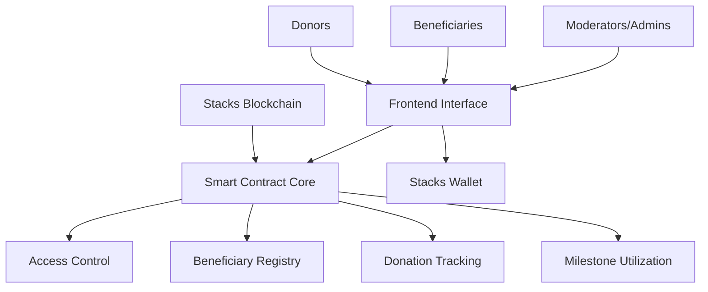

# StacksAid: Transparent Charity Platform on Stacks

**StacksAid** is a decentralized charity platform built on the [Stacks blockchain](https://www.stacks.co/) to ensure **transparent donations**, **verified beneficiary management**, and **milestone-based fund utilization**, all backed by on-chain immutability.

## 🚀 Key Features

* 🔐 **Role-Based Access Control**

  * Admins, Moderators, and Beneficiaries with specific capabilities.
* 🧾 **Beneficiary Registry**

  * Verified campaigns with goals, funding status, and automated updates.
* 💸 **Transparent Donations**

  * Real-time donation tracking and immutable STX transactions.
* 🎯 **Milestone-Based Fund Utilization**

  * Funds released only upon Admin approval of defined milestones.
* 🛡️ **Security**

  * Authorization enforcement, input validation, and fund sufficiency checks.

## ⚙️ Architecture Overview



## 📐 System Design

### 🧑‍⚖️ Roles

| Role        | Code | Capabilities                             |
| ----------- | ---- | ---------------------------------------- |
| Admin       | `u1` | Full access; manage roles, approve funds |
| Moderator   | `u2` | Register beneficiaries                   |
| Beneficiary | `u3` | Track personal fundraising progress      |

### 🗂 Storage Maps

* `roles`: Maps users to their roles
* `beneficiaries`: Campaign registry with metadata and targets
* `donations`: STX donation logs
* `utilizations`: Milestone fund usage records

## 🛠️ Smart Contract Functions

### 🔐 Role Management (Admin only)

```clarity
(set-role (user principal) (new-role uint))
(remove-role (user principal))
```

### 🧾 Beneficiary Management

```clarity
(register-beneficiary (name (buff 50)) (description (buff 100)) (target-amount uint))
(get-beneficiary (id uint))
```

### 💸 Donations

```clarity
(donate (beneficiary-id uint) (amount uint))
(get-donation-by-id (id uint))
(get-donation-count)
```

### 🎯 Fund Utilization (Admin only)

```clarity
(add-utilization (beneficiary-id uint) (description (buff 100)) (amount uint))
(approve-utilization (beneficiary-id uint) (milestone-id uint))
(get-utilization-by-id (id uint))
(get-utilization-count)
```

## ❗ Error Codes

| Code | Meaning                |
| ---- | ---------------------- |
| u100 | Unauthorized access    |
| u101 | Duplicate registration |
| u103 | Insufficient funds     |
| u104 | Beneficiary not found  |

## 🔬 Testing & Development

### 🧪 Test Suite

```bash
clarinet test --coverage
```

**Example Scenario**:

```clarity
(define-public (test-donation-flow)
  (begin
    (contract-call? .stacksaid register-beneficiary "Education Fund" "School supplies" u5000)
    (contract-call? .stacksaid donate u1 u1000)
    (ok "Test completed")
  )
)
```

### 🧱 Deployment

#### Prerequisites

* [Clarinet](https://docs.hiro.so/clarinet)
* Node.js v16+
* Stacks Wallet (Testnet/Mainnet)

#### Setup

```bash
git clone https://github.com/real-joy/stacks-aid.git
cd stacks-aid
npm install
```

#### Run Console

```bash
clarinet console --testnet
```

#### Deploy

```bash
clarinet deploy --testnet  # For testnet
clarinet deploy --mainnet  # For mainnet
```

---

## 🤝 Contributing

1. Fork the repository
2. Create a feature branch: `git checkout -b feature/xyz`
3. Commit your changes: `git commit -am 'Add xyz'`
4. Push branch: `git push origin feature/xyz`
5. Submit a Pull Request

---

## 🙏 Acknowledgments

* [Stacks Blockchain](https://www.stacks.co/)
* [Hiro PBC](https://www.hiro.so/) for developer tooling
* Open-source community and Clarity contributors
